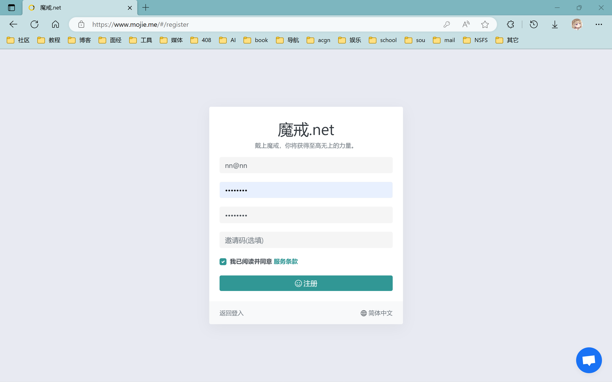
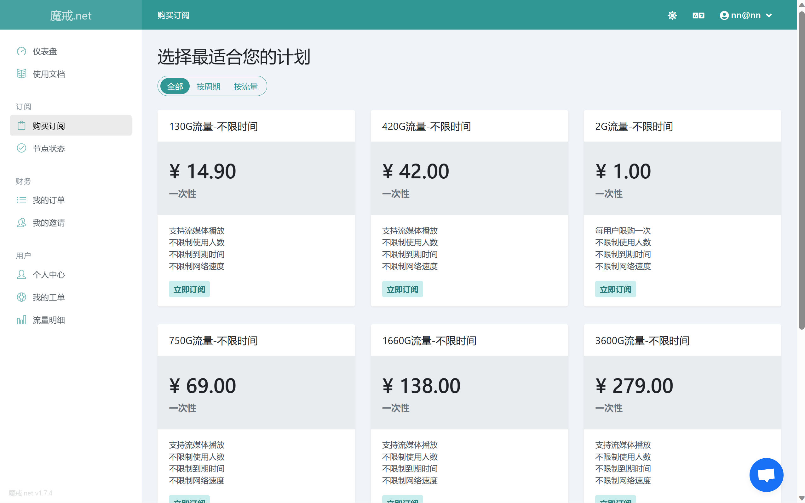
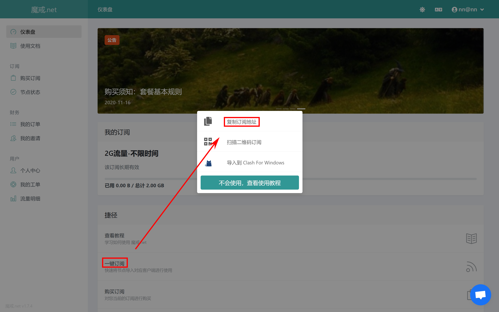
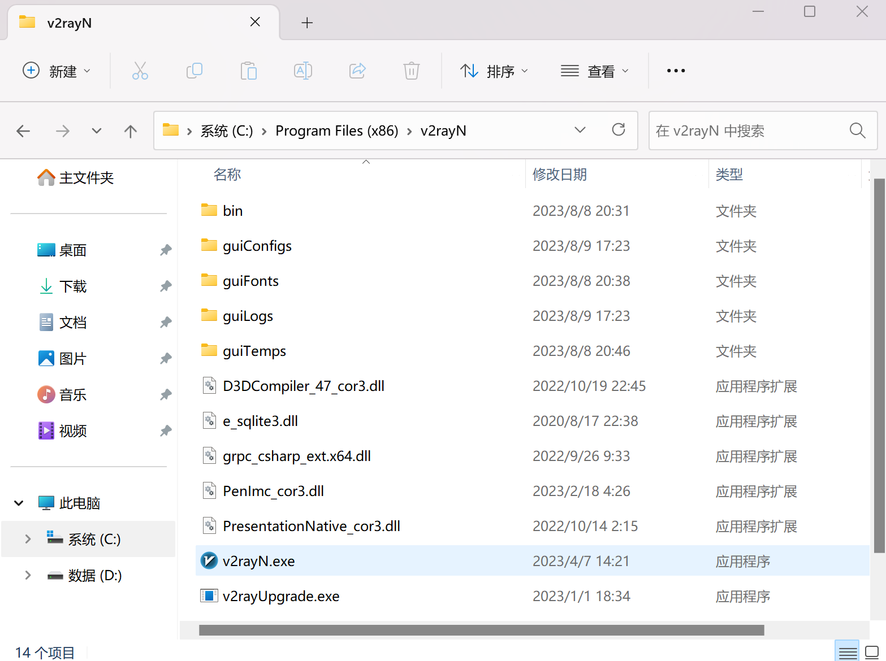
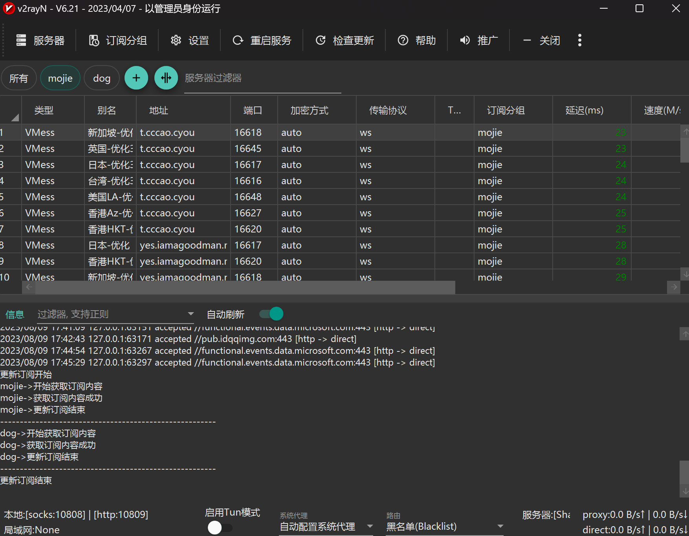

第一步：点击网站注册帐号

网站：[https://www.mojie.me/#/register](https://)

注意：

因为曾经发生过账号密码泄露的事情

所以账号名你只要按邮箱格式输就可以了，密码尽量不要用你常用的密码

举例：
账号名：nn@nn
密码：88888888



<br/>

第二步：花一块钱买2G流量平时用来上上网站就够用了。当然，上面的账号也是可以登的，快来白嫖诺诺吧~



<br/>

第三步：复制订阅信息



<br/>

第四步：将v2rayN.7z解压放到任意位置，(如果是c盘请给管理员权限)，双击v2rayN.exe运行



<br/>

第五步：点击右下角出现的带v的托盘，选择服务器->从剪贴板导入批量URL；选择订阅分组->更新全部订阅(不通过代理)；双击一个延迟低的节点即可。(如果复制不成功就返回网站再复制一遍)



<br/>

第六步：打开终端粘贴以下命令并运行(前提是你已经安装了git并配置好了环境变量)

```gitignore
git config --global https.proxy http://127.0.0.1:10809
git config --global https.proxy http://127.0.0.1:10809
git config --global http.proxy 'socks5://127.0.0.1:10808'
git config --global https.proxy 'socks5://127.0.0.1:10808'
```

<br/>

上述步骤完成以后当你git clone不下来的时候请运行v2rayN.exe，右击右下角托盘图标选择自动配置系统代理，再clone网速就正常了（不行就进入v2rayN Ctrl+A Ctrl+P 选择一个延迟低的）